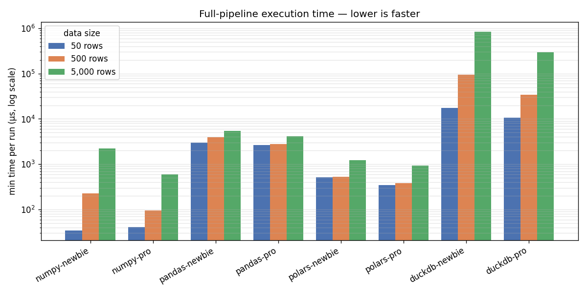
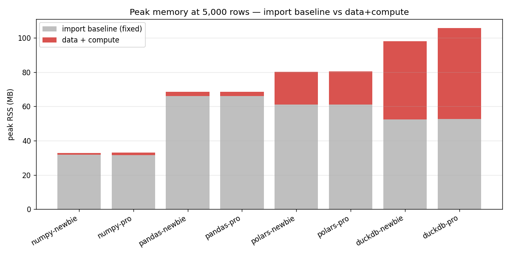

# data-engineering-comparison

A small, reproducible **micro-benchmark** that runs the *same* 5-step weather
pipeline through four engines — **numpy**, **pandas**, **polars**, **duckdb** —
each written twice: a **newbie** (naive) version and a **pro** (optimized)
version. It measures **time** and **peak memory**, and reports both *which
engine* is faster and *how much the way you use it* matters.

> 8 cases = 4 engines × {newbie, pro}. All eight produce **byte-identical**
> output (enforced by an equivalence gate) so the comparison is fair.



*Full-pipeline time, log scale (Apple Silicon). numpy wins at this tiny scale;
polars clearly beats pandas; how you use each tool (newbie → pro) often matters
as much as which tool. Full tables, memory chart, and caveats below.*

## The pipeline

Identical semantics across all eight cases, on a seeded synthetic weather dataset
(`station_id, date, temperature, humidity, precipitation, wind_speed`) joined to a
small station dimension:

1. **load** → 2. **filter** (`temperature > 20 AND humidity < 80`) →
3. **groupby-aggregate** (per station: mean temp, max humidity, total precip, count) →
4. **join** (station name + climate zone) → 5. **sort** (total precip desc)

Data sizes: **50 / 500 / 5 000** rows.

## Quick start

```bash
make sync     # install the exact locked deps (uv, Python 3.13)
make test     # correctness + cross-engine equivalence gate
make bench    # run all benchmarks, regenerate charts + results/REPORT.md
make check    # ruff + format + pyrefly
make fix      # auto-fix lint/format
```

## Reproducibility

Results should not drift because a library shipped a new release:

- **Engines pinned to major.minor** in `pyproject.toml` (`numpy==2.4.*`,
  `pandas==3.0.*`, `polars==1.41.*`, `duckdb==1.5.*`, `psutil==7.2.*`).
- **`uv.lock` is committed** — it pins the *exact* patch version + hash of every
  dependency. `make sync` reproduces a byte-identical environment.
- **Data is seeded** — same seed → same rows.

**Tested with** (Python **3.13.11**):

| numpy | pandas | polars | duckdb | psutil | pytest-benchmark |
|------:|-------:|-------:|-------:|-------:|-----------------:|
| 2.4.6 | 3.0.3  | 1.41.2 | 1.5.3  | 7.2.2  | 5.2.3            |

> Python is pinned to **3.13** (`>=3.13,<3.14`): polars has no cp314 wheel yet.

## How it works (honest measurement)

- **Time** — `pytest-benchmark` (serial, `-p no:xdist`) for the headline
  full-pipeline number; an in-process per-op breakdown for the step view.
- **Memory** — peak RSS via `resource.getrusage` in an **isolated subprocess**
  per case (only that engine's library is imported; numpy is shared because the
  data generator uses it). The import-only **baseline is subtracted** to separate
  fixed import cost from the engine's first-use allocation. (`tracemalloc` is
  *not* used — it misses C-level allocations.)
- Timing and memory run as **separate paths** (benchmark loops would inflate RSS).

## Results

Snapshot from one run (Apple Silicon, min of many samples — absolute numbers
differ per machine; regenerate with `make bench`).

### Execution time


**Full-pipeline time — min µs**

| Case | 50 | 500 | 5 000 |
|------|---:|---:|---:|
| numpy-newbie | 34.4 | 226.2 | 2,216.3 |
| numpy-pro | 40.6 | 94.8 | 600.2 |
| pandas-newbie | 2,991.8 | 3,985.5 | 5,377.5 |
| pandas-pro | 2,647.0 | 2,767.3 | 4,174.7 |
| polars-newbie | 514.8 | 527.3 | 1,213.1 |
| polars-pro | 345.0 | 378.0 | 939.7 |
| duckdb-newbie | 17,310 | 94,653 | 837,688 |
| duckdb-pro | 10,746 | 34,205 | 295,531 |

**Newbie → Pro speedup (×)**

| Engine | 50 | 500 | 5 000 |
|--------|---:|---:|---:|
| numpy | 0.8× | 2.4× | 3.7× |
| pandas | 1.1× | 1.4× | 1.3× |
| polars | 1.5× | 1.4× | 1.3× |
| duckdb | 1.6× | 2.8× | 2.8× |

### Memory use



**Peak RSS — MB (`total` / `data`, where `data` = total − import baseline)**

| Case | 50 | 500 | 5 000 |
|------|---:|---:|---:|
| numpy-newbie | 31.9 / 0.1 | 32.0 / 0.1 | 32.8 / 1.0 |
| numpy-pro | 32.1 / 0.5 | 32.3 / 0.7 | 33.1 / 1.5 |
| pandas-newbie | 67.1 / 1.1 | 67.2 / 1.3 | 68.5 / 2.5 |
| pandas-pro | 67.8 / 1.8 | 67.9 / 1.9 | 68.5 / 2.5 |
| polars-newbie | 72.8 / 11.8 | 73.2 / 12.2 | 80.2 / 19.1 |
| polars-pro | 73.3 / 12.2 | 73.4 / 12.3 | 80.5 / 19.4 |
| duckdb-newbie | 94.1 / 41.8 | 94.3 / 42.0 | 98.0 / 45.6 |
| duckdb-pro | 68.1 / 15.5 | 71.9 / 19.4 | 105.7 / 53.2 |

### What this run shows (and the caveats that matter)

- **At tiny scale, numpy wins on both speed and memory** — bare in-memory arrays,
  no query-engine overhead, ~32 MB resident.
- **polars clearly beats pandas** (its real competitor) at every size here —
  ~4× faster at 5 000 rows — while using a bit more memory.
- **"How you use it" is a real axis.** The newbie→pro speedup (up to ~3.7× for
  numpy, ~2.8× for duckdb) is often comparable to the gap *between* engines.
- **Import cost differs by engine.** The grey baseline grows numpy (~32 MB) <
  duckdb (~52) < polars (~61) < pandas (~66). The red `data` segment is each
  engine's first-use arena/buffer allocation (duckdb's step-by-step temp tables
  cost the most), *not* the few-hundred-KB dataset.
- **Time ≠ memory.** duckdb-**pro** is faster than duckdb-newbie yet uses *more*
  memory at 5 000 rows (one big vectorized query vs small step-by-step temp
  tables) — the two axes are independent.
- **Small-data noise.** Many timings are sub-millisecond and some (notably
  duckdb-newbie's row-by-row inserts) vary run-to-run; treat absolute values as
  indicative and trust the ordering, not the third digit.

> ⚠️ Scope note: this compares a *query engine* (polars/duckdb) vs *array/frame
> libraries* (numpy/pandas) on a **tiny relational** pipeline. numpy wins here
> because the data is small; polars/duckdb are built to win on **large
> relational** workloads (joins / group-bys over millions of rows). For simple
> element-wise math, numpy can stay ahead even at large sizes. The 50k–millions
> crossover is deferred to v2.

## Project layout

```
src/weather_bench/
  common/   schema.py · data.py (seeded generator) · contract.py (PipelineProtocol)
  engines/  numpy_{newbie,pro}.py · pandas_{newbie,pro}.py · polars_{newbie,pro}.py
            duckdb_{newbie,pro}.py · registry.py
  bench/    timing.py (per-op) · memory.py + _mem_child.py (isolated subprocess RSS)
  report/   generate.py (make bench entry point) · charts.py (PNGs in docs/)
tests/      test_data.py · test_equivalence.py · benchmarks/test_timing.py
```

Built with GSD planning (`.planning/`, local-only).
